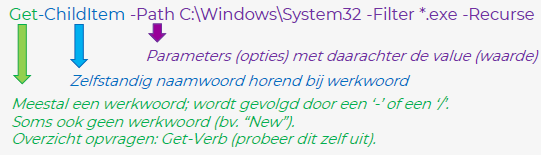

# PowerShell Syllabus

# Hoofdstuk 1: Introductie PowerShell

## 1.1 Introductie

## 1.2 Basisconcepten

### Syntax Commando



### Wildcards

- * ⇒ match 0 of meer karakters
- ? ⇒ match 1 karakter
- [x-z] ⇒ match een reeks karakters van x tot z
- [abc] ⇒ match een karakter uit de reeks

### Alias

- alternatieve naam voor een cmdlet of commando
- aliassen worden in huidige sessie gemaakt
    - bewaren ⇒ `Export-Alias`
    - later importeren ⇒ `Import-Alias`
- aliassen kunnen zelf aangemaakt worden, of heel wat ingebouwd
    - `dir` & `ls` ⇒ `Get-ChildItem`
    - `Get-Alias` ⇒ overzicht van alle aliassen
    - `Set-Alias` ⇒ alias te wijzigen of nieuwe te maken
    - `New-Alias` ⇒ nieuwe alias maken

### Providers

- PowerShell is een objectgeoriënteerde taal
    - veel objecten worden gemapt als objecten binnen een soort van virtueel bestandssysteem
        - laat toe om door objecten te navigeren
- hiervoor worden providers gebruikt
    - voor het register
    - voor certificaten
    - voor aliassen
    - maar ook voor bepaalde Microsoft producten (Active Directory)
- `Get-PSProvider` ⇒ beschikbare (ingeladen) providers opvragen

### Pipeline

```powershell
|
```

- Resultaat van commando doorgeven aan volgend commando
    - analoog aan pipeline UNIX

## 1.3 Getters en Setters

### Get Commando's

- gebruikt om object op te halen
- na commando '-', gevolgd door (werk-)woord dat aangeeft welke operatie uitgevoerd wordt op object

### `Get-Help`

- helpfunctie
- updaten van help content ⇒ `Update-Help`

### `Get-Command`

- geeft lijst met beschikbare commando's (cmdlets) & functies van alle ingeladen modules

### `Get-History`

- geeft overzicht van commando's die je in de huidige sessie hebt gebruikt

### `Get-Item`

- ophalen van object
    - bestanden en mappen op logische schijven
    - items uit register
    - elk willekeurig item dat in PowerShell wordt gemapt

### `Get-ChildItem`

- voorzetting uit vorig commando
- haalt kinderen op van huidig object

### Set Commando's

- worden gebruikt om een object te wijzigen
- verandert dus zaken in een Windows systeem
- enkele handige Set commando's
    - `Set-ACL` ⇒ rechten aanpassen op bestanden en shares
    - `Set-ADGroup` ⇒ Active Directory groep aanpassen of toevoegen
    - `Set-ADUser` ⇒ Active Directory gebruiker aanpassen of toevoegen
    - `Set-Alias` ⇒ Alias aanmaken of wijzigen
    - `Set-Date` ⇒ Aanpassen datum en/of tijd

## 1.4 New

### New Commando's

- worden gebruikt om een nieuw object aan te maken
- algemene commando's
    - `New-Object` ⇒ aanmaken .NET of COM object
    - `New-Item` ⇒ nieuw item, type item afhankelijk van locatie
    - `New-ItemProperty` ⇒ nieuwe property voor item (typisch: register)
- Specifieke commando's
    - `New-Service`
    - `New-PsDrive`
    - `New-LocalUser`

# Hoofdstuk 2: Variabelen, invoer en uitvoer

## 2.1 Introductie

## 2.2 Variabelen

### Eenvoudige variabelen

- $ ⇒ variabele definiëren
- = ⇒ waarde toekennen aan variabelen

### Variabelen beheren

- `Dir Variable` ⇒ lijst van alle varaiabelen
- `Del Variable:<naam>` ⇒ verwijder variabele $<naam>
- `Get-Variable | Remove-Variable` ⇒ verwijdert alle variabelen
- `Remove-Variable-Name <naam>` ⇒ betere manier om variable te verwijderen

### Types Variabelen

| Naam  | Wat?  |
| :---  | :---  |
| int   | 32 bits integer   |
| long  | 64 bits integer   |
| byte  | 8 bits karakter   |
| string    | tekst         |
| bool      | boolean: true/false   |
| decimal   | 128 bits decimal      |

- je kan type opgeven tussen [ ]

### Casten

- via [ ]
    - forceert conversie naar specifiek type
    - geeft mogelijks RunTimeException

## 2.3 Operators

### Operators

- kunnen gebruikt worden in commando of expressie
- meerdere types operatoren om variabelen te manipuleren
    - Arithmetic Op ⇒ wiskundige bewerkingen
    - Assignment Op ⇒ toekennen nieuwe waarde
    - Comparison Op ⇒ vergelijken waarden & test condities
    - Logical Op ⇒ meerdere statements combineren
    - Redirection Op ⇒ omleiden uitvoer
    - Split & Join Op ⇒ indelen in substrings / concateneren
    - Type Op ⇒ console op type

### Arithmetic Operators

- analoog aan andere programmeertalen
- kunnen gebruikt worden voor elk .NET type die dit ondersteunen
    - + ⇒ optellen
    - - ⇒ aftrekken
    - * ⇒ vermenigvuldiging
    - / ⇒ deling
    - % ⇒ rest bij deling (modulus)

### Assignment Operators

- analoog aan andere programmeertalen

| symbool  | wat?  |
| :---  | :---  |
| =     | stel waarde variable in    |
| =+    | verhoog waarde variable met opgegeven waarde  |
| -=    | verminder waarde variable met opgegeven waarde    |
| *=    | vermenigvuldig waarde variabele met opgegeven waarde  |
| /=    | deel waarde variabele met opgegeven waarde            |
| %=    | deel waarde variabele, toekennen rest bij deling (modulus) als nieuwe waarde  |
| ++    | verhoog waarde var met 1  |
| --    | verlaag waarde var met 1  |

### Comparison Operators

| symbool   | wat?  |
| :---      | :---  |
| -eq   | test of waarden gelijk zijn (equal)   |
| -ne   | test of waarden verschillend zijn (not equal) |
| -gt   | test of eerste waarde strikt groter is dan tweede waarde (greater than)   |
| -lt   | test of eerste waarde strikt kleiner is dan tweede waarde (less than) |
| -ge   | test of eerste waarde groter of gelijk is aan tweede waarde (greater or equal)    |
| -le   | test of eerste waarde kleiner of gelijk is aan tweede waarde (less or equal)  |

### Logical Operators

| Symbool   | wat?  |
| :---      | :---  |
| -and  | geeft True als beide uitdrukkingen True zijn |
| -or   | geeft True als minstens 1 van beide uitdrukkingen True is |
| -xor  | geeft True als slechts 1 van beide uitdrukkingen True is (exclusive OR)   |
| -not  | geeft True als uitdrukking False is (negative)    |
| ! | zelfde als -not   |

## 2.4 Invoer en uitvoer

### Standaard invoer en uitvoer (Host)

- standaard alles in de console
- `Write-Host` ⇒ expliciet naar de console schrijven
- `Read-Host` ⇒ eenvoudige invoer van gebruiker

### Write-Host

- typisch in combinatie met Read-Host
- uitvoer naar host display
    - mogelijk om ForegroundColor & BackgroundColor in te stellen
    - mogelijk om separator in te stellen via `-Separator<string>`
    - bij gebruik `-NoNewLine` : volgend Write-Host commando op zelfde lijn
- uitschrijven van object ⇒ ToString() oproepen
- output date naar pipeline ⇒ Write-Output

### Andere vormen van Write

- `Write-Debug` ⇒ schrijf debog boodschap naar console
- `Write-Warning` ⇒ schrijf een warning bericht
- `Write-Error` ⇒ schrijf opbject naar error stream
- `Write-Output` ⇒ schrijf object naar pipeline

### Invoer en uitvoer naar tekstbestand

- `Out-File`: uitvoer naar tekstbestand
- `Get-Content`: lees tekstbestand

### Invoer en uitvoer naar CSV

- `Export-Csv`: uitvoer in CSV formaat
- `Import-Csv`: maak custom objecten aan op basis CSV

### Invoer en uitvoer naar XML

- `Export-Clixml` : uitvoer in XML formaat
- `Import-Clixml` : maak objecten aan op basis XML

### Andere vormen uitvoer

- alle opties met "out"
- Conversie

# Hoofdstuk 3: Scripts

## 3.1 Van commando's naar scripts

### PowerShell scripts

- tekstbestand extensie .ps1
- bevat commando's die uitgevoerd moeten worden
    - worden uitgevoerd van boven naar onder
    - mogelijk om aantal commando's na elkaar uit te voeren (automatiseren)
    - je kan op 1 lijn meerdere commando's plaatsen, gescheiden met ;
    - ook mogelijk om functies en andere controlestructuren te gebruiken
- Bewerken script kan met eenvoudige teksteditor
    - Notepad, nano, vim, VS Code
    - PowerShell Integrated Scripting Environment (ISE)

### Uitvoeren scripts

- kan op 2 manieren
    - via klassieke DOS command prompt
        - powershell.exe -noexit c:\script.ps1
    - rechtstreeks in een PowerShell console
        - .\script.ps1 (als script.ps1 in huidige directory staat)

### Execution Policy

- standaard geen rechten om script uit te voeren
- wordt ingesteld via Execution Policy
    - `Get-ExecutionPolicy` : toont huidige waarde
    - `Set-ExecutionPolicy` : om waarde te wijzigen
- mogelijke waarden:
    - Restricted: scripts niet toegelaten
    - AllSigned: Enkel script die ondertekend zijn door trusted publisher
    - RemoteSigned: gedownloade scripts dit ondertekend zijn door trusted publisher en eigen scripts
    - Unrestricted: alle scripts kunnen uitgevoerd worden (risicovol!)
- `Set-ExecutionPolicy RemoteSigned`

### Commentaar

- # voor 1 regel in commentaar
- <#...#> voor meerdere regels in commentaar

## 3.2 Controlestructuren

### Controlestructuren

- PS ondersteunt ook de meeste controlestructuren zoals testen op een voorwaarde (if-then-else) en iteraties over een bepaalde set (lussen of loops)

### De if-conditie

- syntax:

```powershell
if(voorwaarde){actie}
[optioneel] elseif(voorwaarde2) {actie2}
[optioneel] else {actie3}
```

### De switch-conditie

- Syntax:

```powershell
switch(conditie)
{
	<case 1> {actie 1; [optioneel] break}
	[optioneel] <case 2> {actie 2; [optioneel] break}
	....
	[optioneel] default {default actie}
}
```

### De while-loop

- syntax:

```powershell
while(voorwaarde){
actie
}
```

### Do....until loop

- syntax:

```powershell
do{actie} until(voorwaarde)
```

### Do...while loop

- syntax

```powershell
do{actie}while(voorwaarde)
```

### For-loop

- Syntax:

```powershell
for (initiële waarde iterator; voorwaarde; herhaling){
actie
}
```

### Foreach-loop

- syntax:

```powershell
foreach(placeholder in collectie) {
actie met placeholder
}
```

## 3.3 Script Blocks en Functies

### Script Block

- collectie statements of expressies
- ingesloten [ ]
- kan toegekend worden aan een variabele
- kan parameters hebben en return value
- heeft geen naam
- kan uitgevoerd worden met Invoke-Command
- Algemene Syntax

```powershell
{<lijst met statements>}
```

### Scripts block met parameters

- Syntax:

```powershell
{
	Param([type]$par1 [optioneel],[type]$par2)
	<lijst met statements>
}
```

- oproepen via Invoke-Command
    - parameter ScriptBlock bevat scriptblock
    - parameter ArgumentList bevat waarden parameters

### Functie

- gelijkaardig aan script block
- heeft een naam
- kan parameters hebben & return waarde
- oproepen functie via naam
- syntax:

```powershell
function Naam {
	<lijst met statements>
}
```

### Functie met parameters

- kan gelijkaardig aan syntax codeblock:

```powershell
function Naam{
	Param([type]$par1 [optioneel], [type]$par2)
	<lijst met statements>
}
```

- of via alternatieve syntax (zoals in Java):

```powershell
function Naam([type]$par1 [optioneel], [type]$par2) {
	<lijst met statements>
}
```

# Hoofdstuk 4: DNS

## 4.1 Configuratie DNS client

### Configuratie DNS client

- opvragen configuratie DNS client als object
    - algemeen: `Get-DnsClient`
    - voor specifieke interface: `Get-DnsClient -InterfaceAlias "LAN"`
- Get-DnsClient geeft object terug dat je kan aanpassen
    - via parameter `-InputObject`
        
        ```powershell
        $cll = Get-DnsClient
        Set-DnsClientServerAddress -InputObject $cll -ServerAddresses ("8.8.8.8","8.8.4.4")
        ```
        
    - via pipeline
        
        ```powershell
        Get-DnsClient | Set-DnsClientServerAddress -ServerAddresses ("8.8.8.8")
        ```
        

### Syntax Get-DnsClient

```powershell
Get-DnsClient
[-InterfaceIndex <UInt32[]>]
[[-InterfaceAlias] <String[]>]
[-ConnectionSpecificSuffix <String[]>]
[-RegisterThisConnectionsAddress <Boolean[]>]
[-UseSuffixWhenRegistering <Boolean[]>]
[-CimSession <CimSession[]>]
[-ThrottleLimit <Int32>]
[-AsJob]
[<CommonParameters>]
```

### Andere nuttige commando's

- ophalen inhoud (client) cache ⇒ `Get-DnsClientCache`
- leegmaken (client) DNS cache ⇒ `Clear-DnsClientCache`
- ophalen ingestelde DNS servers ⇒ `Get-DnsClientServerAddress`
- wijzigen DNS servers ⇒ `Set-DnsClientServerAddress`
- aanpassen algemene config ⇒ `Set-DnsClientGlobalSetting`
- uitvoeren DNS query ⇒ `Resolve-DnsName`

## 4.2 Configuratie DNS server

### Configuratie DNS server

- Om een DNS server te beheren vanuit PowerShell moeten zowel DNS als de management tools geïnstalleerd zijn
    - controle installatie ⇒ `Get-WindowsFeature -Name *DNS*`
    - DNS installeren via PowerShell ⇒ `Add-WindowsFeature -Name DNS -IncludeManagementTools`

### Aanmaken zone(s)

- aanmaken primaire zone `Add-DnsServerPrimaryZone`

### Ophalen zone(s)

- via commando `Get-DnsServerZone`
    - `Get-DnsServerZone` ⇒ geeft alle zones terug die beheerd worden door de lokale DNS server
    - `Get-DnsServerZone -ComputerName "dc1.hogent.local"` ⇒ idem vorig commando maar voor server dc1.hogent.local
    - `Get-DnsServerZone-Name "example.com"` ⇒ specifieke zone (example.com) ophalen

### Verwijderen zone(s)

- via commando `Remove-DnsServerZone`
    - voorbeeld: `Remove-DnsServerZone "example.com" -PassThru -Verbose`
        - verwijderen van zone met naam example.com
        - -PassThru -Verbose ⇒ extra output generen en confirmatie te vragen
        - -Force ⇒ geen bevestiging vragen

### Toevoegen A record(s)

- via commando `Add-DnsServerResourceRecordA`

### Toevoegen andere record(s)

- via algemeen commando `Add-DnsServerResourceRecord`

### Ophalen record(s)

- ophalen via commando `Get-DnsServerResourceRecord`

### Verwijderen record(s)

- commando: `Remove-DnsServerResourceRecord`
- vrij analoog aan vorige commando's

### Algemene instellingen DNS Server

- ophalen/wijzigen DNS forwarder ⇒ `[Get/Set]-DnsServerForwarder`
- ophalen/leegmaken DNS server cache ⇒ `[Get/Clear]-DnsServerCache`
- ophalen/leegmaken statistieken DNS server ⇒ `[Get/Clear]-DnsServerStatistics`

# Hoofdstuk 5: Beheer Active Directory

## 5.1 Organizational Units

### Aanmaken OU

- commando: `New-ADOrganizationalUnit`

### Ophalen OU(s)

- commando: `Get-ADOrganizationalUnit`

### Wijzigen OU

- commando: `Set-ADOrganizationalUnit`

### Verwijderen OU

- commando: `Remove-ADOrganizationalUnit`

## 5.2 AD gebruikers

### Aanmaken gebruiker

- commando: `New-ADUser`

### Ophalen gebruiker

- commando: `GetADUser`

### Wijzigen gebruiker

- commando: `Set-ADUser`

### Verwijderen geburuiker

- commando: `Remove-ADUser`

## 5.3 AD Groepen

### Beheren AD groepen

- commando's
    - aanmaken ⇒ `New-ADGroup`
    - ophalen ⇒ `Get-ADGroup`
    - wijzigen ⇒ `Set-ADGroup`
    - verwijderen ⇒ `Remove-ADGroup`

### Beheren leden van AD Groepen

- commando's
    - toevoegen lid ⇒ `Add-ADGroupMember`
    - ophalen leden ⇒ `Get-ADGroupMember`
    - verwijderen lid ⇒ `Remove-ADGroupMember`

# Hoofdstuk 6: DHCP

## 6.1 Algemene instellingen

### Installeren en herstarten DHCP

- installeren DHCP rol en bijhorende management tools ⇒ `Install-WindowsFeature DHCP -IncludeManagementTools`
- DHCP service (her)starten ⇒ `Restart-Service dhcpserver`
- DHCP server autoriseren binnen AD ⇒ `Add-DhcpServerInDC -DnsName winserver1.hogent.local -IPAddress 192.168.0.1`
- controle ⇒ `Get-DhcpServerInDC`

### Client: instellen DHCP

- activeren DHCP op adapter LAN
    - ophalen interface ⇒ `$nic = Get-NetAdapter -Name LAN`
    - verwijder 'oude' gateway ⇒ `$nic | Remove-NetRoute -Confirm$false`
    - DHCP activeren ⇒ `$nic | Set-NetIPInterface -DHCP Enabled`
- DNS servers instellen via DHCP ⇒ `$nic | Set-DnsClientServerAddress -ResetServerAddresses`

## 6.2 DHCP Scopes

### Aanmaken en ophalen scope

- aanmaken scope ⇒ `Add-DhcpServerv4Scope`
- ophalen scope: `Get-DhcpServerv4Scope`

### Wijzigen en verwijderen scope

- wijzigen scope: `Set-DhcpServerv4Scope`
- verwijderen scope: `Remove-DhcpServerv4Scope`

### Aanmaken en ophaen Exclusion Range

- toevoegen exclusion range: `Add-DchpServerv4ExclusionRange`
- ophalen exclusion range: `Get-DhcpServerv4ExclusionRange`

### Verwijderen Exclusion Range

- verwijderen exclusion range: `Remove-DhcpServerv4ExclusionRange`

### Aanmaken en ophalen DHCP opties

- instellen DHCP option: `Set-DhcpServerv4OptionValue`
- ophalen DHCP option: `Get-DhcpServerv4OptionValue`

### Verwijderen DCHP opties

- verwijderen optie: `Remove-DhcpServerv4OptionValue`

### Volledig voorbeeld

- aanmaken en activeren scope
    
    ```powershell
    Add-DhcpServerv4Scope -Name "ScopeHoGent" -StartRange 192.168.0.100
    						-EndRange 192.168.0.200 -SubnetMask 255.255.255.0 -State Active
    ```
    
- Aanmaken exclusion range
    
    ```powershell
    Add-DhcpServerv4ExclusionRange -ScopeID 192.168.0.0 -StartRange 192.168.0.150
    ```
    
- Instellen DHCP option 3 (=router/gateway)
    
    ```powershell
    Set-DhcpServerv4OptionValue -OptionID 3 -Value 192.168.0.1 -ScopeID 192.168.0.0
    ```
    
- instellen DHCP option (= DNS server) en 15 (=domain name)
    
    ```powershell
    Set-DhcpServerv4OptionValue -DnsDomain hogent.local -DnsServer 192.168.0.1
    ```
    

## 6.3 DHCP Reservaties en Leases

### Toevoegen en ophalen reservaties

- toevoegen reservatie: `Add-DhcpServerv4Reservation`
- ophalen reservatie: `Get-DhcpServerv4Reservation`

### Verwijderen reservaties

- verwijderen reservatie: `Remove-DhcpServerv4Reservation`

### Ophalen Leases

- ophalen DHCP lease record: `Get-DhcpServerv4Lease`

### Toevoegen en verwijderen lease

- toevoegen DHCP lease record: `Add-DhcpServerv4Lease`
- verwijderen DHCP lease record: `Remove-DhcpServerv4Lease`