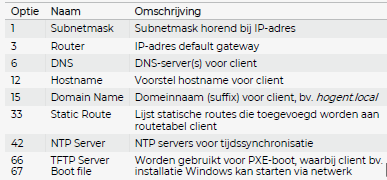

# Windows Server Syllabus

# Hoofdstuk 1: Virtualisatie

## Wat is Virtualisatie?

### Hypervisors

- Type 1:
    - Complexer
    - Native/ bare metal hypervisor
    - Spreekt hardware rechtstreeks aan
- Type 2:
    - Hosted hypervisor
    - Draait bovenop een OS
    - Spreekt fysieke hardware aan via functies van OS

# Hoofdstuk 2: Windows Server

# Hoofdstuk 3: Routing en Virtuele Netwerken

## 3.1 VirtualBox Network Modes

### NAT

- Default
- VM kan op internet via virtual NAT apparaat
- Gues krijgt IP via DHCP
    - Kan niet gewijzigd worden
    - Virtual DHCP server: 10.0.2.2/24
    - Elke VM: 10.0.2.15/24
    - Default gateway: 10.0.2.2/24

### NAT Network

- Vergelijkbaar met NAT op router
- VM kan op internet en kan ook aan andere VM’s
- Guest krijg IP via DHCP
    - Default: 10.0.2.0/24
    - Default gateway: 10.0.2.1/24
    - Kan gewijzigd worden

### Bridged Adapter

- Bridge op fysieke netwerkinterface
    - Deelt de fysieke netwerkinterface
    - Juiste netwerkinterface selecteren!!!
- Meeste mogelijkheden
    - VM kan aan host en toestellen op het LAN en WAN netwerk
    - Guest kan aan andere guests
- Guest krijg IP via DHCP
    - In dezelfde range als host

### Internal Network

- Geïsoleerd network voor communicatie tussen VM’s
- Bruikbaar in situaties waarin VM’s met elkaar moeten communiceren
    - VM kan volledig communiceren met andere VM
    - Kan niet rechtstreeks aan internet
    - Host kan niet aan VM
- Prima voor simuleren van echt netwerk

### Host-Only Adapter

- Bedoeld voor communicatie tussen host en guests
- VM kan communiceren met andere VMs die verbonden zijn met zelfde netwerk
- VM kan wel niet aan toestellen op LAN netwerk
- Mgoelijk om ip-adressen te configureren
    - DHCP kan in- of uitgeschakeld worden

## 3.2 Configuratie NAT in Windows Server

# Hoofdstuk 4: Domain Name System (DNS)

## 4.1 Werking DNS

### Algemene termen

- Domain Naming System (DNS)
    - vertaalt naam naar IP-adres of omgekeerd
    - laat ons toe te surfen op het internet zonder alle IP-adressen te kennen
- DNS Server
    - beheert aantal zonefiles
    - spreekt andere servers aan voor zones niet in eigen beheer
- DNS Client
    - ingebouwd in OS
    - stuurt vragen door naar DNS Server

### Waarvoor gebruikt?

- vertalen naam ⇒ IP (foward IP lookup)
- vertalen IP ⇒ hostname (reverse IP lookup)
- zoeken naar mailserver (MX lookup)
- zoeken naar andere services (Service Record Lookup)

### DNS Tree Structure

### Root Servers

- verzameling root servers verdeeld over 13 named authorities

### DNS Client

- programma ingebouwd in OS
- gebruikt voor DNS queries (opzoekingen)
    - eerst zelf proberen antwoorden ⇒ kijken in cache en hosts file
    - geen antwoord ⇒ vragen sturen naar ingestelde DNS server
- Welke DNS server(s) gebruikt?
    - cmd: `ipconfig /all` of `netsch`
    - PowerShell: `Get-DnsClientServerAddress`
    - GUI: `ncpa.cpl`
- Wijzigen DNS-server
    - cmd: `netsh`
    - PowerShell: `Set-DnsClientServerAddress`
    - GUI: `ncpa.cpl`

### DNS Server

- bevat zone files voor verschillende domeinen
- gaat antwoorden op DNS queries van clients
    - eerst kijken of hij zelf antwoord heeft ⇒ zelf verantwoordelijk voor zone, of antwoord in (server) cache
    - indien niet ⇒ andere DNS server(s)
        - recursief via root hints
        - vraag doorsturen naar forwarder (= andere DNS Server)

### DNS Server - Zones

- 3 types
    - Primary Zone
        - zelf verantwoordelijk, primaire aanspreekpunt
    - Secondary Zone
        - maakt kopie van bestaande zone (high availability)
    - Stub Zone
        - beperkte kopie van zone (enkel SOA, NS & glue A records)
- Forward lookup zone
    - domein of subdomein
    - typisch voor opzoeken IP-adres adhv naam (forward IP lookup)
    - kan volgende records bevatten: SOA, NS, A, AAAA, MX, SRV, CNAME
- Reverse lookup zone
    - optioneel
    - gebruikt voor opzoeken hostname adhv IP (reverse IP lookup)
    - bevat hoofdzakelijk PTR records (naast SOA & NS)

### DNS Server - Zone Records

### DNS Server - Root Hints

- recursief andere server contacteren
- starten bij root server, en zo via TLD recursief verder gaan tot server verantwoordlijk voor zone gevonden is
- DNS server contacteer hier altijd meerdere servers
- !!! niet altijd mogelijk, vooral probleem bij interne DNS servers (bv door firewall)

### DNS Server - Forwarder

- vraag letterlijk doorsturen naar andere server
- forwarder zal dan recursief ander DNS servers contacteren
- DNS server contacteert hierbij dus maar 1 andere server, is dus DNS client voor de forwarder

# Hoofdstuk 5: Active Directory

## 5.1 Waarom Active Directory

### Peer-to-Peer vs.Client-Server

- de 2 manieren om bronnen en applicaties beschikbaar te stellen aan andere toestellen in het netwerk
    - server = het toestel dat de diensten aanbiedt
    - client = het toestel dat deze diensten gebruikt
- peer-to-peer
    - geen duidelijk onderscheid tussen servers en clients
    - een toestel in het netwerk kan tegelijk een server en client zijn
    - + de werklast kan verdeelt worden
    - + hele goede performantie met hele hoge snelheden

- Client-server
    - beheer van dit netwerk gebeurt centraal
        - 1 centrale server die typisch 24/7 online is

### Lokale vs Centrale gebruikers

### Korte geschiedenis

- Windows NT 3.x/4: introductie domein
    - Windows Server Domain system
    - Centrale opslag van gebruikers en toestellen
    - vrij beperkt: enekl overzicht verbonden en geregistreerde toestellen
- Windows Server 2000: introductie Active Directory
    - Domein Controller draait Active Directory Domain Service (AD DS)
    - eerste versie nog vrij beperkt
    - veel uitbreidingen in Windows Server 2003 en 2008

## 5.2 Active Directory Domain Services

### Active Directory

- Directory Service
- Hiërachische structuur
- volgens Client-Server principe
- beheer relatie tussen bronnen en gegevens
- gebruikers krijgen toegang tot bronnen via AD DS
- ⇒ een grote database waar gegevens en objecten in zitten

### Authenticatie en Autorisatie

- Authenticatie
    - inloggen op het netwerk
    - typisch: username en wachtwoord
    - vergelijken met gegevens in centrale databsse (AD)
- Autorisatie
    - na authenticatie
    - toegang krijgen tot bronnen in het netwerk
    - op basis van rechten in Access Control Lists (ACLs)

### Objecten en LDAP

- AD is dus een verzameling van objecten
    - verschillende types objecten
    - elk object heeft bepaalde kenmerken (properties)
- toegang tot inforamtie in directory via LDAP
    - Active Directory
    - OpenLDAP
- LDAP specifieke syntax om object te beschrijven
    - dn: DistinguishedName
    - CN: Common Name object
    - OU: Organizational Unit
    - DC: Domain Component

### Kerberos

- protocol voor authenticatie
    - gebruikt door LDAP
    - maakt beperkt vorm van Single Sign-on mogelijk
    - maakt gebruik van symmetrische encryptie
- Ontwikkeld door MIT
    - gebaseerd op mythologisch karakter Kerberos (driekoppige hond die toegang tot Hades bewaakte)
- Ingelogde gebruiker krijgt ticket, geldig voor sessie
    - ticket vertrouwd door andere servers die protocol kennen
    - bij uitloggen sessie afgebroken en is ticket niet meer geldig
- Kerberos is multi-platform
    - Unix, Linux, Windows, MacOS,...

### AD & LDAP

- Active Directory = Directory Server
    - database van objecten
- LDAP = toegang tot database
    - manier om te communiceren met AD

## 5.3 Domeinen, trees en forests

### Domein, tree en forest?

- een domein is een logische groep van objecten die dezelfde AD database delen
- een tree = een verzameling van 1 of meerdere (sub)domeinen in eenzelfde namespace
- forest = een verzameling van 1 of meerdere trees in verschillende namespaces. Tussen de verschillende trees in forest is er een bepaalde trust relationship

## 5.4 Redundantie

### Redundantie en FSMO

- binnen 1 domein mogelijk om meerdere DCs te hebben voor redundantie
- Multi-master: aanpassingen mogelijk vanaf elk DC
    - kan echter leiden tot conflicten
    - in geval van conflict: laatste aanpassing wint
- Single-master: 1 DC voor aanpassingen
    - vroeger (NT4.0): Primary Domain Controller (PDC) rol
    - Nu: Flexible Single Master Operations (FMSO) rollen
    - Er zijn 5 FSMO rollen

### FSMO rollen

- Schema master
    - enige DC die updates kan doen directory schema
    - schema wordt gerepliceerd naar andere DCs
- Domain Naming master
    - verantwoordelijk voor forest-wide domain name space
    - enige DC die domein kan toevoegen/verwijderen in directory
- RID Master
    - nodig voor verplaatsen object naar andere domein
    - maakt SID aan dat bestaat uit SID domein + RID voor object
    - 1 per domein
- PDC emulator
    - vooral gebruikt voor time synchronization
- Infrastructure master
    - update SID en DN van object wanneer benarderd vanuit ander domein

### Global Catalog

- Belangrijkste rol in AD!!!
- Elke DC kan deze rol uitvoeren
- Global Catalog bevat alle objecten binnen forest
    - complete kopie van objecten eigen domein
    - gedeeltelijke kopie van alle objecten andere domeinen
- wordt gebruikt om objecten te vinden forest
- voor load balancing: maak van elke DC een GC

# Hoofdstuk 6: Disk Management en Shared Folders

## 6.1 Disk Management

### Disks, Partities en Volumes

- Computersysteem bevat 1 of meerdere schijven
    - SSD, HDD, SSHD (Solid State Hybrid drive)
- schijf bestaat uit meerdere partities
    - bijgehouden in partitietabel
    - MBR(Master Boot Record) of GPT (GUID Partition Table)
- elke partitie heeft eigen bestandssysteem
    - NTFS, FAT32, ext4,...
    - bestandssysteem biedt implementatie bestanden en directories
- volume is abstractie voor storage container
    - bestaat uit 1 of meer partities op 1 of meer schijven (via RAID)
    - in Windows kan je drive letter toekennen aan volume

### MBR vs. GPT

- MBR heeft enkele beperkingen
    - partitietabel opgeslagen in boot sector aan begin schijf
    - Max. grootte schijf: 2TB
    - Max. 4 primaire partities
- GPT is opvolger van MBR
    - elke partitie heeft eigen (unieke) GUID
    - ondersteuning voor schijven +2TB
    - theoretisch onbeperkt aantal partities (WIndows max. 128)
    - werkt enkel op modern 64-bit OS

### Bestandssystemen Windows

- vroeger: default FAT
    - FAT12 /  FAT16 / FAT32
    - nummer = aantal bits gebruikt voor adressering
    - beperkingen: FAT32 partitie max 2TB, bestand max 4GB
- NU: default NTFS
    - New Technology File System
    - ondersteuning voor grotere bestanden (+4 GB) en grotere partities
    - gebruikt journaling
    - ondersteuning voor NTFS rechten

### FAT32 < = > NTFS

- partitie converteren van FAT32 naar NTFS kan op 2 manieren
    - opnieuw formatteren
        - verlies van alle data
        - enkel maar doen op lege partities
    - via command prompt
        - convert commando
        - geen verlies van data
        - wel vrije ruimte nodig

### Schijfbeheer in Windows

- via GUI: Disk Management (Schijfbeheer - diskmgmt.msc)
    - overzicht van alle schijven en volumes
    - disk converteren naar MBT of GPT
    - volumes aanmaken, wijzigen of verwijderen
- via Server Manager → File and Storage Devices
    - enkel op Windows Server, niet overzichtelijk
- via command prompt: commando `diskpart`
    - opent CLI met functionaliteit gelijkaardig aan Disk Management
- via PowerShell commando's
    - Get-Commando * disk *, * partition *, * volume *

## 6.2 Shared Folders

### Gedeelde mappen

- je kan een map met bestandne delen in een netwerk
    - verschillende protocollen: SMB / CIFS, AFP, NFS
    - Windows: default SMB (Server Message Block)
- je kan permissies instellen op niveau van shared folders
    - geeft aan welke gebruikers toegang hebben tot welke shared folders en welk soort rechten (lees- en/of schrijfrechten)
    - permissies zijn altijd cumulatief, effectieve permissies zijn dus combinatie van verschillende rechten (NTFS permissies op folder, bestand en SMB permissies)

### Syntax SMB Share

- algemene notatie:
    - smb://<FQDN toestel>/<naam share>/<naam file>
    - FQDN naam is Fully Qualified Domain Name
    - naam share en naam file zijn optioneel
- binnen Windows: UNC notatie
    - UNC = Universal Naming Convention
    - \\<FQDN toestel>\<naam share>\<naam file>
    - je kan dit intypen in adresbalk van Windows Explorer
    - indien geen naam share ⇒ overzicht van alle zichtbare shares
    - ook verborgen shares aanmaken ($ aan einde naam)

### Administratieve Shares

- verborgen shares op Windows toestel
- eenvoudige teogang tot elk volume op toestel in netwerk
- kunnen gebruikt worden door System Administrators
- 1 share per volume, naam share = driveletter + $
- indien gewenst kan deze verwijderen
    - gewoon verwijderen: terug aangemaakt na reboot
    - je kan ze ook permanent uitschakelen
    - let op met verwijderen of uitschakelen: soms zijn ze nodig voor correcte werking Windows, vooral probleem in Windows Vista en Windows 7

### Beheer SMB shares

- verschillende manieren om shares toe te voegen, aan te passen of te verwijderen
    - via de Server Manager
    - via de MMC Computer Management
    - via Windows Verkenner

## 6.3 Toegangsrechten

### NTFS Permissies / Toegangsrechten

- worden vastgelegd via ACL
    - ACL (= Access Control List) ⇒ overzicht van wie wat kan doen met folder of bestand
    - rechten of permissies zijn regels die op een object geplaats worden
    - wordt dus gebruikt om te controleren welke gebruikers toegang hebben en welke rechten ze hebben
    - aanpassen NTFS rechten?
        - Administrator, owner(heeft object aangemaakt) en alle users en security groups met "Full Control" op bestand of map kunnen rechten aanpassen

### Basis NTFS permissies

- **Read**: kan bestanden en eigenschappen zien
- **Write**: kan naar bestaznd schrijven
- **Read & Execute**: kan bestand (zoals scripts) uitvoeren
- **Modify**: kan bestand en properties aanpassen, inclusief verwijderen en toevoegen bestanden aan map of properties aan bestand
- **Full Control**: lezen, bewerken, toevoegen, verplaatsen en verwijderen bestanden, en wijzigen permissies voor alle bestanden en subdirectories

### Geavanceerde NTFS permissies

- **Traverse Folder/Execute File**: navigeren door map(folder) of bestand uitvoeren(file)
- **List Folder/Read Data**: bestandne zien in map(folder) of inhoud zien van bestand(file)
- **Read Attributes**: lezen NTFS attributen van object
- **Read Extended Attributes**: idem als vorige maar voor uitgebreide attributen (worden gebruikt door sommige programma's)
- **Create Files/Write Data**: bestanden toevoegen aan map(folder) of bestand bewerken(file)
- **Create Folder/Append Data**: subdirectory maken in map(folder) of data toevoegen aan einde bestand(file)
- **Write Attributes**: NTFS attributen bewerken
- **Write Extended Attributes**: NTFS uitgebreide attributen bewerken
- **Delete subfolders and files**: subdirectories en bestanden verwijderen
- **Delete**: folder of bestand verwijderen
- **Read Permissions**: lezen permissies van folder of bestand
- **Change Permissions**: wijzigen permissies
- **Take Ownership**: laat je toe om eigenaar(owner) te worden van bestand of map. De eigenaar kan altijd de permissies wijzigen van de map of het bestand

### Toekennen Permissies

- kan expliciet of via overerving (inheritance)
    - expliciet = rechtstreeks op bestand of map
    - via overerving = bestand neemt rechten over van map
- ja kan permissies toelaten (allow) of weigeren (deny)
    - deny krijgt voorrang op Allow
    - volledige volgorde: Expliciet Deny  - Expliciet Allow - Inherited Deny - Inherited Allow
- kunnen ingesteld worden op niveau van gebruiker (user) of groep (group)
    - meestal op nivau van groep (eenvoudiger beheer)
- om permissies te wijzigen met je Owner zijn of de permissie Full Control hebben op het item

### NTFS Permissies op meerdere niveaus

- permissies zijn cumulatief
    - effectieve rechten = combinatie rechten gebruiker en groep
- permissies op bestandne voorrang op permissies folders
- Overerving van permissies (inheritance)
    - bestanden en subfolders nemen standaard rechten over
    - je kan dit uitschakelen indien gewenst
- DENY heeft altijd voorrang op andere rechten
    - let dus op bij toekennen DENY, gebruik dit enkel waar nodig

### SMB Permissies/rechten

- analoog aan NTFS permissies kan je ook rechten instellen op niveau van een (SMB) netwerkshare
- Let wel op voor conflicten tussen NTFS en SMB permissies
    - meestal ofwel rechten instellen op niveau NTFS, ofwel op niveau SMB
        - NTFS permissies beste optie
        - share permissies kan dan gewoon staan op Full Control
    - bij combinatie: goed begrijpen in welke volgorde rechten overlopen worden

### SMB Permissies

- Full Control: Lees- en schrijfrechten, maar ook aanpassen permissies en Ownership nemen van bestanden
- Change: Lees-, schrijf- en uitvoerrechten (gebruiken kan lezen/schrijven/verwijderen van bestanden en mappen in de share)
- Read: inlezen bestanden en inhoud van mappen

### SMB + NTFS Permissies

- opletten! Algemeen: laagste rechten gelden
- voorbeeld: Share: Read, NTFS: Full Control
    - ⇒ gebruiker zal Read rechten hebben op share
- TIP: gebruik enkel NTFS permissies
    - werkt zowel voor lokale- als netwerkgebruikers
    - meer mogelijkheden dan SMB permissies

# Hoofdstuk 7: Beheer Active Directory

## 7.1 Structuur Active Directory

### Algemene structuur

- nieuw domein ⇒ default (boom-)structuur aangemaakt in AD
    - doorbladeren via
        - ADSI Edit
        - Active Directory Users en Computers
        - AD Administrative Center
    - hiërarchische structuur vergelijken met bestanden (=objecten) in mappen (=CNs en OUs)
    - nieuwe objecten worden default aangemaakt in een bepaalde locatie
        - Gebruikers en groepen ⇒ CN 'Users'
        - Toestellen toegevoegd aan domein ⇒ CN 'Computers'
        - Domeincontrollers ⇒ OU 'Domain Controllers'
- Structuur default installatie Active Directory
    - Computers en Users zijn default containers voor toestellen en gebruikers
    - Domain Controllers is een default OU voor domeincontrollers
- ADSI Edit: toont nog enkele verborgen containers
    - duidelijk een verschil tussen Containers (CN=...) en Organizational Units (OU=...)
    - ADSI Edit laat toe om alle attributen van objecten te bekijken en bewerken
    - via ADSI Edit kan je ook het schema en de AD configuratie bewerken

### Default Containers

- bij standaard installatie worden er een aantal default containers aangemaakt, waaronder:
    - CN = Computers
    - CN = Users
- in het LDAP path krijgen deze een verwijzing via CN
- dit zijn geen OUs, kunnen geen group policies aan gekoppeld worden
- zorgen voor backward compatibiliteit met oudere NT4-gebaseerde domeinen

### Organizational Units

- OU wordt gebruikt om een logische groep van objecten te maken (bv. user accounts, service accounts,...)
- het is mogelijk om aan een bepaalde OU policies toe te kennen die dan van toepassing zijn voor alle objecten binnen deze OU
- Een domain administrator kan custom OUs toevoegen, bewerken of verwijderen, via GUI of via PowerShell
- Het is ook mogelijk om objecten rechtstreeks aan te maken binnen een OU of objecten te verplaatsen naar een andere OU

### Aanmaken OUs

- kan grafisch (bv. via Active Directory Users and Computers) of via PowerShell
- je kan OUs ook nesten (OU aanmaken binnen andere OU
- bij aanmaken kan je kiezen voor "Protect container from accidental deletion
    - je kan deze OU niet zomaar verwijderen (bescherming)
    - om OU met deze optie te verwijderen
        - vink de optie View  → Advanced Features aan in AD Users en Computers
        - in de Properties van het object, tabblad object kan je deze optie aan- of uitschakelen

### Delegeren admin taken via OUs

- via OUs kan je ook een admin taken delegeren naar een gebruiker of groep zonder hem/haar administrator te moetn maken
- zo kan je bv. aan een gebruiker rechten toekennen om wachtwoorden te kunnen resetten van gebruikers binnen een bepaalde OU
- taken die je kan delegeren
    - beheer gebruikers (aanmaken, wijzigen, verwijderen)
    - beheer groepen
    - aanpassen leden van groepen
    - aanpassen Group Policies
    - Resetten wachtwoorden gebruikers

## 7.2 Gebuikers, computers en groepen

### Centrale opslag in AD

- via AD kunnen gebruikers, toestellen en groepen centraal beheer worden
- er wordt een onderscheid gemaakt tussen:
    - Domeincontrollers (=default in OU Domein Controllers)
    - toestellen die lid zijn van het domein (=default in CN Computers)
- Bij promotie tot DC worden lokale gebruikers en groepen vervangen door domeingebruikers en -groepen
    - default komen deze in de CN Users
- binnen een organisatie is het echter aangeraden om gebruikers en toestellen op te slaan in custom OUs
    - Group Policies (GPOs) toekennen aan OUs

### Toevoegen toestel aan domein

- Domeincontrollers: via promotie
    - vroeger via dcpromo, nu via Server Manager
- Ander servers en toestellen van gebruikers
    - kunnen manueel toegevoegd worden in AD
    - beter: toestel lid maken van domein via sysdm.cpl
- bij toevoegen toestel aan domein wordt ook een A-record aangemaakt in DNS

### Beheer gebruikers en groepen

- grafisch: via Active Directory Users en Computers
    - aanmaken nieuwe gebruiker/groep:
        - rechtermuisknop op OU of container → New → User / Group
    - kan eventueel ook via Active Directory Administrative Center
    - bewerken: rechtermuisknop op object —> Properties
- of via PowerShell (zie PS5: Beheer AD)

### Active Directory groepen

- vergelijkbaar met (lokale) groepen binnen Windows
- veel-op-veel relatie:
    - gebruiker kan lid zijn van meerdere groepen
    - groep kan meerdere gebruikers bevatten
- opvragen leden/groepen
    - via Properties van Group kan je de leden zien (tabblad Members)
    - via Properties van User kan je groepen zien (tabblad Member Of)
- AD Groepen kunnen gebruikt worden om permissies in te stellen (bv. NTFS of SMB permissies)

## 7.3 Group Policies (ter info)

### Group Policies

- een Group Policy (GPO) is een feature van Windows die administrators toelaat om besturingssystemen, applicatie en gebruikersinstellingen centraal te beheren
- Group Policies kunnen dus gebruikt worden om de veiligheid van gebruikers te verhogen
- group policies kunnen toegekend worden aan 1 of meerder AD containers, zoals sites, domein of OUs
- Group policies worden toegepast in de LSDOU volgorde

### Voorbeelden van Group Policies

- toegang tot control panel aan/uitschakelen
- toegang tot command prompt aan/uitschakelen
- verwijderenbare opslag (usb/CD/DVD) aan/uitschakelen
- guest account uitschakelen
- instellen vereisten wachtwoord (lengte, geldigheid, complexiteit,...)
- uitvoeren van scripts toelaten/blokkeren
- ....

### Verwerking GPOs: LDSOU

- Group Policies kunnen gedefinieerd worden op verschillende niveaus: lokaal, site, domein of OU
- de group policies worden verwekt in LSDOU volgorde
    - Local : computer policy (ingesteld lokaal op toestel)
    - Site Level policies (ingesteld op niveau van site in AD)
    - Domain policies (ingesteld op niveau van domein in AD)
    - Organizational Unit policies (ingesteld op niveau van OU in AD)
- in geval van conflicten: laatst toegepaste policy wint
    - OU policies hebben dus de hoogste 'precendence' (voorrang)

### Verwerking GPOs: meerdere OUs

- OUs kunnen andere (kind) OUs bevatten, dus een object kan in meerdere OUs zitten, en op elk niveau kunnen GPOs ingesteld zijn
- in dit geval worden GPOs gelinkt aan OUs toegepast vanaf de root, dus eerst op hoogste niveau van AD, dan GPOs toegepast op kind van root, enz....

### Meerdere GPOs gelinkt aan OU

- het is ook mogelijk om meerdere group policies (GPOs) te linken aan 1 Organization Unit (OU)
- in dat geval wordt de volgorde van verwerking vastgelegd door de link orde
- De GPO met de laagste link order wordt laatst toegepast en heeft dus de hoogste voorrang
    - je kan deze Link Order wijzigen via de tool Group Policy Management
    - GPO met Link Order 1 wordt dus toegepast na GPO met Link Order 2 en heeft dus hogere voorrang

### Inheritance

- GPOs ingesteld op niveau van domein, site of OU worden standaard dus overgeërfd door kin Ous (=inheritance)
- je kan dit echter uitschaklen zodat GPO van ouder niet toegepast wordt op kind OU

# Hoofdstuk 8: Dynamic Host Configuration Protocol (DHCP)

## 8.1 Werking DHCP

### Vaste en Dynamische IP-adressen

- tot nu toe: vaste (static) IP-adressen gebruikt voor WinServer1 en WinClient1
    - zelf IP-adres en subnetmask invullen
    - zelf gateway en DNS-server(s) invullen
- in de praktijk worden IP-adressen voor clients (geen servers) vaak dynamisch toegekend
    - via Dynamic Host Configuration Protocol (DHCP)
    - automatisch toekennen IP (en bijhorende subnetmask) uit vooraf ingestelde range, voor bepaalde tijdsduur
    - ook mogelijk om andere opties mee te geven

### Vier stappen DHCP

1. Client stuurt bij opstarten een DHCPDISCOVER via een broadcast bericht om te zoeken naar een DHCP server
2. een DHCP server op aangesloten netwerk kan antwoorden met DHCPOFFER pakket, dit bericht bevat een voorstel een IP-adres en ander opties (gateway, DNS server(s),...)
3. Client kan dit voorstel aanvaarden en stuurt daarvoor een DHCPREQUEST pakket naar de server
4. tenslotte stuurt de DHCP server nog een laatste DHCPACK pakket om te bevestigen dat dit IP-adres nu toegekend is aan de client

- MERK OP:
    - DHCP server gebruikt UDP poort 67
    - DHCP client gebruikt UDP poort 68

### Vernieuwen lease

- standaard wordt een IP-adres gereserveerd voor de client voor een bepaalde (ingestelde) leasetijd, bv 8 dagen
- wanneer 50% van de leasetijd voorbij is gaat de client proberen om de lease te hernieuwen door rechtsstreeks een DHCPREQUEST pakket te sturen naar de DHCP server, die dit kan bevestigen met een DHCPACK en de lease verlengen
- indien de DHCP server niet reageert zal de client na 87,5% van de leasetijd een nieuwe DHCPDISCOVER versturen. Op dit moment zal de client van elke DHCP server een antwoord accepteren, dus niet noodzakelijk van de originele DHCP server
- indien de client geen antwoord krijgt op een DHCPDISCOVER zal hij een APIPA adres instellen

### APIPA adres

- wanneer er geen DHCP-server antwoordt op de vraag van de client, zal deze automatisch een IP-adres configueren
- hiervoor wordt een IP-adres gebruikt uit een speciale range, dit adres wordt een Automatic Private IP Address (APIPA) genoemd
    - range: 169.254.1.0 - 169.254.254.255
    - subnetmask: 255.255.0.0
    - Default gateway: 0.0.0.0
- als je merkt dat een client een dergelijk adres heeft, is er vermoedelijk iets mis met de netwerkconfiguratie of de configuratie van de DHCP-server

### DHCP Server Option

- naast een voorstel van IP-adres kan de DHCP server in het DHCPOFFER pakket ook enkele andere opties meegeven
- deze opties worden ingesteld adhv DHCP Options en er zijn verschillende opties beschikbaar
- elke optie bestaat uit een vastgelegd nummer en de waarde

### Courante DHCP Server Options

### DHCP Client Options

- bij versturen van de initiële DHCPDISCOVER kan de client zelf ook een aantal opties meegeven als voorstel
- voorbeelden zijn de client identifier (=MAC adres), de naam van het toestel, en een lijst van parameters die de client vraagt aan de server (deze lijst bestaat uit de nummers van de DHCP server opties
- deze opties worden DHCP Client Options genoemd

### Courante DHCP Client Options

### DHCP Options

- De opties die de client verstuurd in de DHCPDISCOVER of ontvangt in het DHCPOFFER zijn maar een voorstel, en worden dus niet noodzakelijk toegepast
- DHCP Server en Client beslissen dus zelf wat ze met de opties doen
- DHCPOFFER kan bv voorstel bevatten voor DNS-servers, maar client kan deze uiteraard negeren en de (handmatig) ingestelde DNS servers gebruiken

### Voordelen DHCP

- eenvoudige configuratie en centraal beheer clients
- vermijden van menselijke fouten bij IP-configuratie
- efficiënte verdeling van beschikbare IP-adressen
- laat toe om een Preboot Execution Environment te gebruiken (PXE). PXE client  kunnen een IP-adres krijgen zonder dat er een OS geïnstalleerd is op de client. Op die manier kunnen clients vanop afstand het OS downloaden en installeren over het netwerk

### Nadelen DHCP

- Single Point of Failure
- subnetten zijn wa lastig te configureren:
    - ofwel moet je in elk subnet een DHCP server configureren
    - of je moet instellen dat DHCPDISCOVER doorgestuurd worden naar een ander netwerk, dit kan via een DHCP Relay. Een DHCP Relay ontvangt, en maakt  een nieuw DHCP berichten aan om te verzenden op een ander netwerk

### DHCP en IPv6
- voor dit OLOD enkel IPv4
- binnen IPv6 zijn er 3 mogelijkheden om automatisch IPv6-adressen toe te kennen aan client
  - Stateless Auto Address Configuration (SLAAC)
  - Stateless DHCPv6
  - Stateful DHCPv6

# Hoofdstuk 9: Internet Information Services
## 9.1 Webservers
### Webserver
- server Software:
  - **doel**: antwoorden op vragen client over World Wide Web (WWW)
  - kan één of meerdere websites bevatten (=hosten)
  - verwerkt inkomende aanvragen over HTTP(S)
- hoofdzakelijk voor ophalen (gegenereerde) HTML documenten
  - maar ook tekst, afbeeldingen, CSS, scripts, en andere documenten
  - werkt via het client-server model
    - server = webserver
    - client = browser (user agent)
  - user agent (browser) stuurt vraag naar server om bepaalde inhoud
    - webserver antwoordt met inhoud of stuurt foutboodschap
    - user agent kan ook content verzenden naar server, bv. bij invullen formulier of opladen bestand
  - Vroeger: eerder statische inhoud (=tekst)
  - nu: hoofdzakelijk dynamische HTML
    - via server-side scripting, bv. met NodeJS, PHP, ASP, JAVA, ...

### Soorten webservers
- vaak gebruikte web servers:
  - apache
    - open source
    - bestaat voor meeste platformen
  - ISS:
    - Closed Source
    - Microsoft
    - enkel Windows
    - Meest recente versie: IIS 10.0
  - Nginx
    - open source
    - bestaat voor meeste platformen

### Interne vs. externe webservers
- de meeste webservers zijn extern (publiek) bereikbaar
  - hebben publiek IP-adres (eventueel via proxyserver)
  - meestal bereikbaar op poort 80 (HTTP) en/of 433 (HTTPS)
- webserver kunnen echter ook gebruikt worden binnen intern netwerk
  - zijn enkel toegankelijk vanaf het LAN netwerk (of via VPN)
  - nuttig voor bv. een intranet website

### Eerste webservers: statisch
- webservers bestaan al sinds begin de jaren 90
- de eerste webservers waren typisch statisch van aard
- gebruikt voor ophalen van statische HTML-pagina's en andere bestanden van de server

### Evolutie naar dynamisch
- sinds midden 2000 zijn de meeste webservers eerder dynamisch
  - opkomst van Web 2.0
- hiervoor draaien programma's op de webservers die dynamisch inhoud van pagina's genereren
  - via server-side scripting
  - bv. PHP, Java, ASP.NET, nodeJS
- vaak wordt hier ook een databank gebruikt voor ophalen van inhoud
  - MySQL, MS SQL, mongoDB,...

### Werking HTTP
- Client stuurt HTTP GET request naar server via HTTP of HTTPS, typisch over TCP poort 80 of 443
  - in bericht geeft client aan welk document (bestand) hij wil ophalen
  - ddaarnaast wordt ook info over de client meegestuurd (OS, browser,..)
- server antwoordt met HTTP response, dit antwoord bevat bv de inhoud van de HTML-pagina
- naast de HTML-pagina zijn er echter vaak ook andere zaken nodig
  - CSS
  - afbeeldingen
  - Javascript en andere scripts
  - ...
- Voor elk item zal een aparte HTTP GET request verstuurd worden
- pagina wordt pas getoond in de client als alle nodige zaken ingeladen zijn

### HTTP Requests
- er zijn 7 verschillende HTTP requests die de client kan versturen
  - **GET**: haal document op gespecificeerd door de URL
  - **HEAD**: haal enkel de headers op voor het document
  - **POST**: verstuur gegevens naar de server
  - **PUT**: vervang gegevens op de server
  - **DELETE**: verwijder document
  - **TRACE**: retourneer de aanvraag, zodat client kan zien wat tussenliggende wijzigingen zijn
  - **OPTIONS**: vraag mogelijkheden server
  - **CONNECT**: vervang verbinding door TCP-/IP-tunnel (bv. voor HTTPS over HTTP)
  - **PATCH**: gedeeltelijke wijziging van document 
- in de praktijk zijn GET (ophalen document) en POST (verzenden data bv. via formulier) meest gebruikt

### HTTP Response
- het antwoord op een HTTP request, de HTTP response, bestaat uit:
  - resultaat code (HTTP Status Code)
  - Headervelden (eigenschappen van document)
  - een lege regel
  - een body (=de boodschap of inhoud van het document)
- Resultaatcode bestaat uit minimaal drie cijfers
- Headervelden geven onder andere aan wat je ophaalt (content type)
- de body is optioneel

### HTTP Resultaatcode
- de resultaatcodes kunnen onderverdeeld worden in 6 types:
  - **1xx**: informational message; typisch volgt nadien nog andere data
  - **2xx**: Succes message; aanvraag succesvol afgehandeld
  - **3xx**: Redirect naar een andere locatie, om welke reden ook
  - **4xx**: Foutboodschap, veroorzaakt door client
  - **5xx**: Foutboodschap, veroorzaakt door server
  - **6xx**: Proxyfout

### HTTPS
- HTTPS zorgt voor extra beveiliging door het verkeer tussen de client en server in beide richtingen te encrypteren
  - aanvankelijk via SSL (= secure sockets layer) protocol
  - tegenwoordig hoofdzakelijk via TLS 1.2 (=transport layer security)
- voor HTTPS wordt gebruikt gemaakt van certificaten die de publieke sleutel van de server bevat

## 9.2 IIS
### IIS
- webserver voor Windows-machines
  - eerste versie was option pack voor Windows NT
  - Sinds Windows 2000 integraal onderdeel van OS
  - Huidige versie: IIS 10.0 (Windows 10 en Windows Server 2016/2019)
- werd (aanvankelijk) hoofdzakelijk gebruikt voor hosten van ASP.NET
  - tegenwoordig ookmogelijk om bv. PHP te draaien
  - eenvoudig te installeren via Microsoft Web Platform Installer
- IIS is een server rol die je kan installeren via de Server Manager
  - kan ook geïnstalleerd worden via PowerShell via Install-WindowsFeature
  - wordt ook gebruikt door vele andere rollen
  - kan is dus groot dat dit al geïnstalleerd is

### Internet Informatie Services (IIS) Manager
- applicatie voor beheren van IIS - openen kan via 
  - server manager > tools > Internet Information Services (IIS) Manager

- kan zowel gebruikt worden om IIS op het lokale toestel te configuren, of om een remote toestel te configureren
- via IIS manager kan je sites aanmaken, certificaten configureren (HTTPS), bindings en handlers instellen, modules (de)activeren, de configuratie van websites aanpassen,...

### Application Pools
- laat toe om verschillende webapplicaties van elkaar af te schermen
- voor elke application pool is er een apart proces dat draait op de server
  - hierdoor zal een applicatie niet crashen als een andere webapplicatie (die een andere pool gebruikt) crasht 
  - elke application pool kan ook andere instellingen hebben op vlak van security
  - application pools zorgen dus voor een vorm van Multi-Tenancy
- een application pool in IIS bestaat uit:
  - een naam (voor de Default Website is dit DefaultAppPool)
  - de versie van .NET CLR (bv. .NET CLR 4.0.30319)
  - de 'managed pipeline mode: Integrated (default) of classic
- je kan een application pool starten, stoppen en "recycle"
  - recycle = afhandelen huidige requests, proces stoppen en nieuw proces starten
  - kan nuttig zijn als een webapp vashthangt in bv. een oneindige lus
  - recyclen komt dus neer (clean) herstarten van het proces

### Sites
- op 1 IIS serve kan je meerdere webapplicaties (=sites) simultaan hosten
- bij aanmaken site moet je volgende zaken opgeven:
  - naam site (puur gebruikt binnen IIS)
  - Application Pool (al dan niet gedeeld met andere sites)
  - Pad naar folder die bestanden van de webapplicatie bevat
  - site binding

### Site Bindings
- via Site Bindings bepaal je hoe je de website kan bereiken
  - welk protocol? HTTP of HTTPS?
  - welk IP-adres? alle IP-adressen van server of enkel via specifiek IP-adres?
  - welke poort? standaard 80, maar kan ook aangepaste poort zijn
  - [Optioneel] Welke host name? (=URL)

- indien meerdere websites "luisteren" op dezelfde interface, via hetzelfde protocol dan zal elke applicatie een andere poort moeten gebruiken
  - clients maken verbinding via een bepaald IP-adres (of hosstname die vertaal wordt naar IP-adrs via DNS), en een poortnummer. De combinatie IP + poort is een **socket**
  - De Default Website in IIS heeft standaard een binding voor alle IP-adressen (via wildcard) op poort 80 (zonder host name)
  - wanneer meerdere websites draaien op dezelfde IIS server (elk op eigen poort) wordt typisch een proxy server (zoals nginx) gebruikt om inkomende aanvragen door te sturen naar de juiste IIS website

### Een webapplictaie uitrollen
1. voeg een nieuwe site toe in IIS, eventueel met nieuwe application pool
2. installeer de nodige modules (bv. .NET Core Hosting Bundle)
3. indien de applicatie gebruikmaakt van een databank: Maak de databank aan en voorzie een (databank) account die toegang heeft tot deze databank
4. kopieer de bestanden van de webapplicatie naar de folder van de IIS site
   1. vanuit IIS kan je rechtstreeks naar de juiste folder navigeren
5. pas (indien nodig) de configuratiebestanden aan 
6. test de website

### IIS + DNS
- we kunnen de website exteren bereiken via de FQDN van de server
- vaak willen we echter andere URL's gebruiken
  - hiervoor moeten we de nodige DNS records toevoegen aan de juiste zone
  - dit kan via het toevoegen van een A-record of CNAME-record
  - eventueel kan je ook gebruikmaken van een wildcard record

